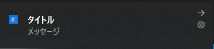

PowerShell で Toast を表示したかったのでやってみた。



## 実装

```powershell
Function Show-Toast( [String] $Message) {
    [Windows.Data.Xml.Dom.XmlDocument, Windows.Data.Xml.Dom.XmlDocument, ContentType = WindowsRuntime] | Out-Null
    [Windows.UI.Notifications.ToastNotification, Windows.UI.Notifications, ContentType = WindowsRuntime] | Out-Null

    $app_id = "{1AC14E77-02E7-4E5D-B744-2EB1AE5198B7}\WindowsPowerShell\v1.0\powershell.exe"
    $doc = New-Object Windows.Data.Xml.Dom.XmlDocument
    $toast = $doc.CreateElement("toast")
    $doc.AppendChild($toast) | Out-Null
    $visual = $doc.CreateElement("visual")
    $toast.AppendChild($visual) | Out-Null
    $binding = $doc.CreateElement("binding")
    $binding.SetAttribute("template", "ToastGeneric") | Out-Null
    $visual.AppendChild($binding) | Out-Null
    $Message.Split("`n") | ForEach-Object {
        $text = $doc.CreateElement("text")
        $text.InnerText = $_
        $binding.AppendChild($text) | Out-Null
    }
    $toastNotification = New-Object Windows.UI.Notifications.ToastNotification $doc
    [Windows.UI.Notifications.ToastNotificationManager]::CreateToastNotifier($app_id).Show($toastNotification)
}
```

## 使用例

```powershell
Show-Toast -Message "タイトル`nメッセージ"
```

## 参考

[Windows トースト通知でリマインダ](https://qiita.com/onoki/items/d85ca3c052ff436e7888)
