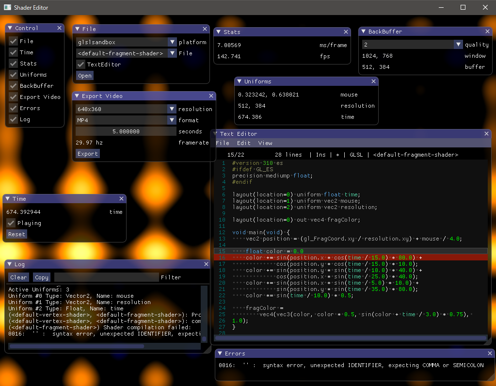

最近ずっとリファクタリングしてた。

[shader_editor](https://github.com/nyamadan/shader_editor)でエラーをパースしてエディタに出すようにしてたんだけど、どうもエラーのフォーマットが環境依存っぽかったのでこの辺を改善することに。
[glslang](https://github.com/KhronosGroup/glslang)にエラーの指摘をまかせることにした。これでどの環境でも同じエラーで指摘されるようになる。

あとは[SPIRV-Cross](https://github.com/KhronosGroup/SPIRV-Cross)を埋め込んでみた。
この結果、デスクトップ用の GLSL に必ず変換して実行するようにしたので、次のようなおまじないを書かなくてもよくなる。

```glsl
#ifdef GL_ES
precision mediump float;
#endif
```

SPIRV-Cross は GLSL のバージョンも変換できるのでこういったところで活躍する。

あと、glslang を埋め込んだということは include が使えるのでこの辺も実装してみたいな。
