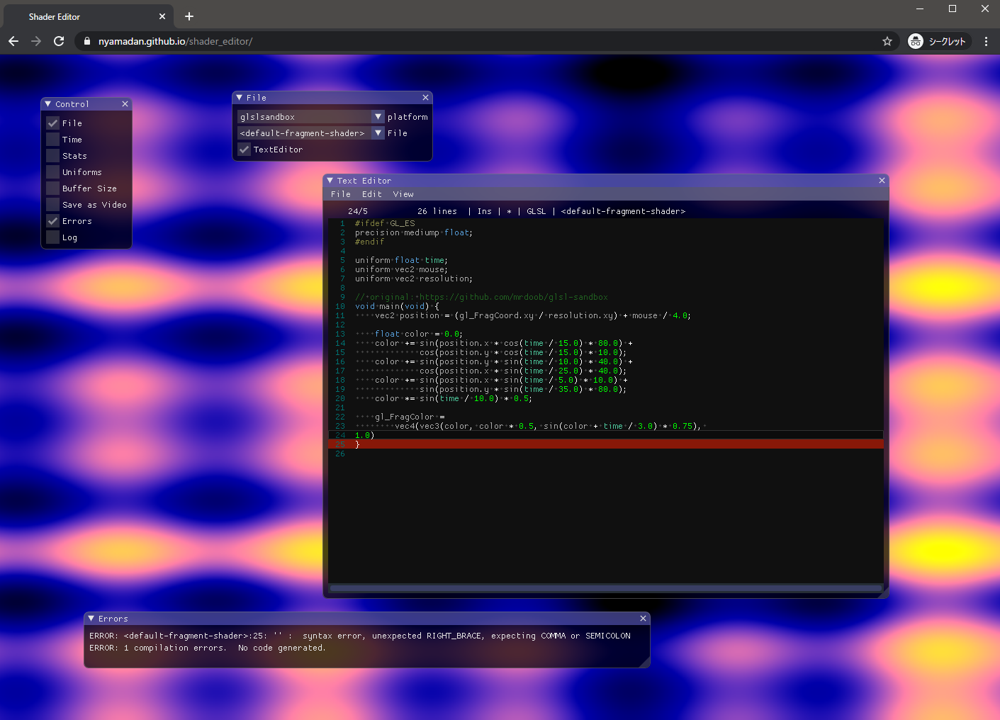

以前からEmscriptenで動くようにしていたが整理しなおした



[shader_editor](https://github.com/nyamadan/shader_editor)をEmscriptenでビルドできるようにした。

[こちら](https://nyamadan.github.io/assets/shader_editor/)で試せます。
たぶん、Chromeで動きます。Firefoxでクラッシュしたんだけどちょっと原因わからず。

エディタ部分は[ImGuiColorTextEdit](https://github.com/BalazsJako/ImGuiColorTextEdit)を使用しているんですけど、
[dear ImGui](https://github.com/ocornut/imgui)の実装を使用していて、こちらがEmscriptenだとうまく動作しないようなので、簡易的に実装してあります。

コピーは `textarea` 経由でないと動作しないようなので `textarea` を使ってコピーします。

ペーストは `paste` のイベントからWASMに渡すので、そのためのメソッドを作ってバインドします。

```cpp
#include <emscripten/bind.h>
using namespace emscripten;

static auto clipboardText = std::string();

void SetClipboardText(const std::string &text)
{
    clipboardText = text;
}

void SetClipboardTextImpl(void *, const char *text) {
EM_ASM({
    const copy = document.createElement("textarea");
    document.body.appendChild(copy);
    copy.style.position = "absolute";
    copy.textContent = UTF8ToString($0);
    copy.focus();
    copy.select();
    document.execCommand("copy");
    document.body.removeChild(copy);
    Module.canvas.focus();
}, text);
    SetClipboardText(text);
}

const char* GetClipboardTextImpl(void *) {
    return clipboardText.c_str();
}

EMSCRIPTEN_BINDINGS(clipboard_module) {
    function("SetClipboardText", &SetClipboardText);
}
```

```js
document.body.addEventListener("paste", (event) => {
  const text = (event.clipboardData || window.clipboardData).getData("text");
  Module.SetClipboardText(text);
  event.preventDefault();
}, false);
```

ImGuiはクリップボードの実装を後から渡してやることができます。

```cpp
    ImGui::GetIO().SetClipboardTextFn = SetClipboardTextImpl;
    ImGui::GetIO().GetClipboardTextFn = GetClipboardTextImpl;
```

これで `Ctrl-v` でテキストを貼り付けられます。

ですけどこれだとメニューからのコピーがうまく動作しなかったり、フォーカスが外れちゃったりなかなか期待通り動きません。

なんかあれこれ頑張るより、[ace](https://ace.c9.io/)とか使ったほうがよさそう。

ちなみに、WebMのエクスポートはちゃんと動きます。