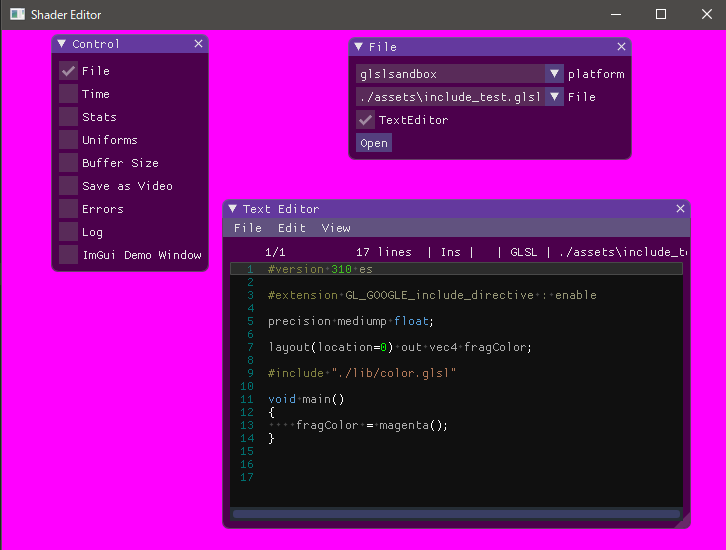

[glslang](https://github.com/KhronosGroup/glslang)には `GL_GOOGLE_include_directive` というのがあってこれを使えば include が使える。

これを使えば次みたいな感じにファイルを分けることができる。

```glsl
vec4 magenta()
{
    return vec4(1.0, 0.0, 1.0, 1.0);
}
```

```glsl
#version 310 es

#extension GL_GOOGLE_include_directive : enable

precision mediump float;

layout(location=0) out vec4 fragColor;

#include "./lib/color.glsl"

void main()
{
    fragColor = magenta();
}
```

[shader_editor](https://github.com/nyamadan/shader_editor)はファイルの変更を検知してシェーダを再コンパイルする機能がついてるけど include までは追いかけられていない。
次はこれをやる。
